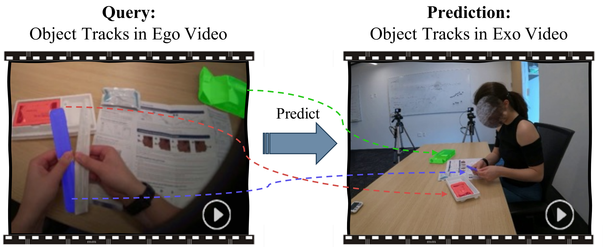

# **ObjectRelator: Enabling Cross-View Object Relation Understanding Across Ego-Centric and Exo-Centric Perspectives (ICCV 2025 Highlight)**

> #### Yuqian Fu, Runze Wang, Bin Ren, Guolei Sun, Biao Gong, Yanwei Fu, Danda Pani Paudel, Xuanjing Huang, Luc Van Gool
>

[Paper](https://arxiv.org/abs/2411.19083) 🌟
[Project Page](http://yuqianfu.com/ObjectRelator/) 🚀

### Features

* 🔥**Ego-Exo Object Correspondence Task:** We conduct an early exploration of this challenging task, analyzing its unique difficulties, constructing several baselines, and proposing a new method.

* 🔥**ObjectRelator Framework:** We introduce ObjectRelator, a cross-view object segmentation method combining MCFuse and XObjAlign. MCFuse first introduces the text modality into this task and improves localization using multimodal cues for the same object(s), while XObjAlign boosts performance under appearance variations with an object-level consistency constraint.

* 🔥**New Testbed** & **SOTA Results:** Alongside Ego-Exo4D, we present HANDAL-X as an additional benchmark. Our proposed ObjectRelator achieves state-of-the-art (SOTA) results on both datasets.

  
  
  

## Updates

- [x] Release evaluation code
- [x] Release training code
- [x] Release data
- [x] Release model

## Installation

See [Installation instructions.](docs/INSTALL.md)

## Data

See [Prepare Datasets for ObjectRelator.](docs/DATASET.md)

## Model Zoo & Quick Start

See [Quick Start With ObjectRelator.](docs/Model Zoo & Quick Start.md)

## Train & Evaluation

See [Train & Evaluation.](docs/Train & Evaluation.md)

## Citation

If you think this work is useful for your research, please use the following BibTeX entry.

```
@article{fu2024objectrelator,
  title={Objectrelator: Enabling cross-view object relation understanding in ego-centric and exo-centric videos},
  author={Fu, Yuqian and Wang, Runze and Fu, Yanwei and Paudel, Danda Pani and Huang, Xuanjing and Van Gool, Luc},
  journal={ICCV},
  year={2025}
}

@article{fu2025cross,
  title={Cross-View Multi-Modal Segmentation@ Ego-Exo4D Challenges 2025},
  author={Fu, Yuqian and Wang, Runze and Fu, Yanwei and Paudel, Danda Pani and Van Gool, Luc},
  journal={arXiv preprint arXiv:2506.05856},
  year={2025}
}
```

## Acknowledgement

Thanks for awesome works: [PSALM](https://github.com/zamling/PSALM/blob/main/) , [LLaVA](https://github.com/haotian-liu/LLaVA) and [Ego-Exo4D](https://ego-exo4d-data.org). Code is based on these works.
